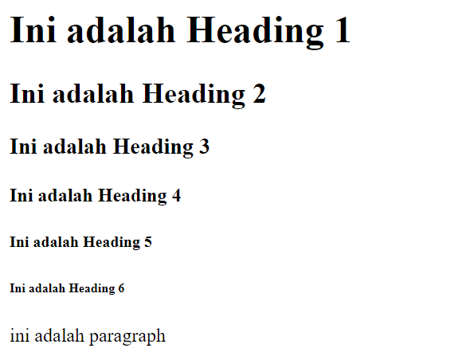
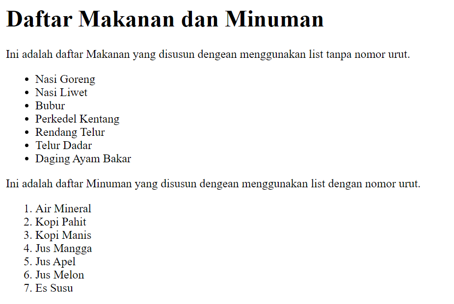
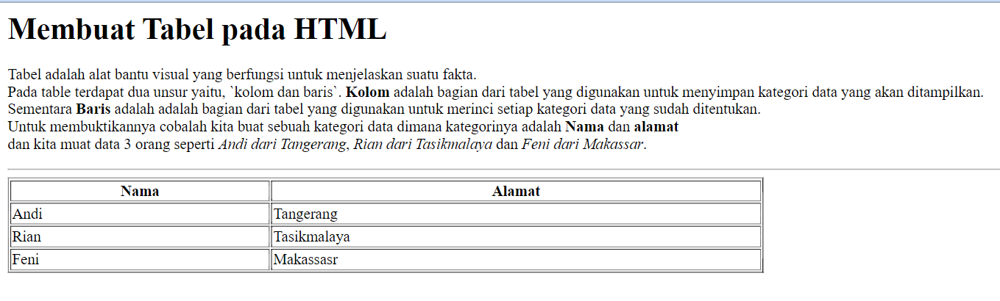

# Perkenalan

Website merupakan representasi data yang dikelola oleh pemiliknya, website dikembangkan dengan menggunakan ragam bahasa pemrograman, salah satunya adalah `HTML`. HTML merupakan salah satu bagian dari website yang tidak terpisahkan, meskipun bukan merupakan dari bahasa pemrograman. HTML adalah `strutktur dasar` dari sebuah website dan merupakan bahasa Markup yang digunakan untuk merepresentasikan susunan kode yang berisi syntax yang sudah disediakan oleh API dari HTML itu sendiri.

# struktur dasar website

HTML sebagai `struktur dasar` website memiliki tiga unsur, yang pertama adalah `html` itu sendiri dan yang kedua adalah unsur `header` dan yang terakhir adalah `body`. jika digambarkan dalam sebuah kode ketiga unsur tersebut akan menjadi seperti berikut:

```html
<html>
    <head></head>
    <body></body>
</html>
```

berdasarkan susunan diatas, ketika kita sudah mengetikkannya, maka kita sudah memiliki `struktur dasar` sebuah website. Adapun Website yang sudah kita lihat di internet, merupakan website yang sudah diatur sedemikian rupa dan ditulis dengan menggunakan berbagai `bahasa pemrograman` supaya website lebih memiliki rasa dan warna saat dikunjungi, terlebih saat ini website lebih digandrungi oleh perusahaan-perusahaan besar. Maka dari itu sudah selayaknya kita para pengguna teknologi memiliki keahlian untuk mempelajari bagaimana sebuah website itu terbentuk.

# Bagian dari struktur website

Untuk dapat membuat sebuah website, kita perlu untuk menambahkan bagian-bagian tertentu pada website. Dalam hal ini kita akan mengenal lebih jauh tentang bagian-bagian yang dimaksud. Sebelumnya kita sudah mengenal `struktur dasar website` maka sekarang kita akan mencoba mempelajari bagian-bagian lain yang dapat menjadikan website kita lebih memiliki warna dan rasa saat dikunjungi. Sebelum melakukan itu, kita harus terlebih dahulu mengenali unsur-unsur lain dari website yang berkaitan dengan bahasa markup yang sedang kita pelajari salah satunya HTML. Unsur atau bagian lain yang akan kita kenali dari HTML salah satunya adalah elemen.

# HTML Element

HTML Element adalah unsur yang terdapat pada ketiga komponen utama pada HTML. HTML Element banyak sekali ragamnya, maka dari itu kita akakn memperkenalkan satu persatu, supaya pembelajaran kita lebih memiliki hasil.

# Mengenal Syntax
`Syntax` merupakan nama-nama yang sudah disiapkan oleh API HTML, sehingga untuk membuat elemen baru kita membutuhkan nama yang sudah disiapkan, kita tidak bisa mengetikkan dan menggunakan sembarang kata atau tulisan untuk menciptakan elemen. Jadi kita harus terlebih dahulu mengenal `syntax`. Perhatikan kode di bawah ini:

```html
<p> ini adalah tulisan </p>
``` 
yang dimaksud syntax adalah apa yang di dalam tanda `< >` sementara yang ada di antara tana `<p>` dan `</p>` merupakan isi dari pada element tersebut. Sedangkan hampir setiap element pada HTML memiliki 3 bagian yaitu, `opening tag` dalam hal ini adalah `<p>` dan yang kedua adalah tulisan `ini adalah paragraph` da bagian yang ketiga adalah `</p>` merupakan `closing tag`. Jadi untuk menulis setiap element kita harus mengenalinya terlebih dahulu nama-nama element tersebut dan mengimpleemntasikannya pada kode yang akan kita muat dalam sebuah file yang memiliki ekstensi HTML. 

# Cara membuat file HTML
File HTML sangat mudah dibuat, sama halnya seperti kamu membuat file atau dokumen word, excel dan power point atau file yang lainnya. Cara termudah untuk membuat file HTML salah satunya adalah dengan memiliki `teks editor`, dalam hal ini kita akan menggunakan teks editor yang sangat mudah di dapatkan dan tentunya tidak perlu repot-repot untuk memasangnya pada perangkat kita. Kita akan menggunakan aplikasi `notepad` bawaan windows, yang dapat kamu akses dengan cara menekan tombol `windows + r` kemudian jika muncul sebuah jendela ketikkan langsung `notepad` dan tekan tombol `OK`, maka notepad akan segera terbuka. 
 

# Typograpy

Thyopgrapy adalah bagian yang tidak terpisahkan dari website, karena biasanya website berisi sejumlah tulisan baik itu berbentuk bacaan atau data. maka dari itu kita dituntut untuk dapat mengenali bagian dari Typograpy. Coba perhatikan table di bawah ini:

|Nama elemen | Fungsi Elemen | Cara Penulisan Syntax |
|-------------|---------------|--------|
| Heading1 | Untuk Judul dalam tulisan dengan ukuran tulisan sangat besasr | `<h1>Judul 1</h1>` |
|Heading2|Untuk Judul dalam tulisan dengan ukuran tulisan lebih kecil dari `<h1></h1>`|`<h2>Judul 2</h2>`|
|Heading3|Untuk Judul dalam tulisan dengan ukuran tulisan lebih kecil dari `<h2></h2>`|`<h3>Judul 3</h3>`|
|Heading4|Untuk Judul dalam tulisan dengan ukuran tulisan lebih kecil dari `<h3></h3>`|`<h4>Judul 4</h4>`| 
|Heading5|Untuk Judul dalam tulisan dengan ukuran tulisan lebih kecil dari `<h4></h4>`|`<h5>Judul5</h5>`|
|Heading6|Untuk Judul dalam tulisan dengan ukuran tulisan lebih kecil dari `<h5></h5>`|`<h6>Judul 6</h6>`|
|Paragraph|Untuk isi tulisan dengan ukuran tulisan standar|`<p>Paragraph</p>`|
|small|Untuk tulisan dengan ukuran tulisan lebih kecil dari `<p></p>`|`<h6>Judul 6</h6>`|
|

Dari tabel di atas, coba kita implementasikan pada file html kita, buatlah sebuah folder dengan nama `HTML` dan buatlah file dengan nama `latihan1.html` di dalam folder `HTML` yang sudah dibuat tadi, kemudian ketikkan kode di bawah ini:

```html
<html>
    <head></head>
    <body>
        <h1>Ini adalah Heading 1</h1>
        <h2>Ini adalah Heading 2</h2>
        <h3>Ini adalah Heading 3</h3>
        <h4>Ini adalah Heading 4</h4>
        <h5>Ini adalah Heading 5</h5>
        <h6>Ini adalah Heading 6</h6>
        <p> ini adalah paragraph
    </body>
</html>
```
simpan pekerjaan kamu dengan menekan tombol `ctrl + s` jika kamu pengguna windows atau `command + s` jika kamu pengguna macbook, sekarang coba kamu buka file yang tersebut dengan mengkliknya dua kali atau kamu `klik kanan` kemudian pilih `open with`, lalu pada menu yang muncul arahkan ke browser seperti `google chrome` atau `mozilla firefox` atau edge atau jika kamu pengguna macbook pilih `safari`. seharusnya hasilnya akan menjadi seperti gambar berikut:



Gambar di atas merupakan hasil dari kode yang kita tulis saat di render oleh browser dalam hal ini saya menggunakan browser `google chrome`. 

# List
Pada HTML selain dapat membuat judul dan paragraph kita juga bisa menambahkan `list` atau `daftar` untuk kebutuhan merepresentasikan data untuk pengunjung yang mengunjungi website kita nantinya. Maka untuk dapat membuatnya, perhatikan tabel berikut:
| Nama elemen | Fungsi | Cara Penulisan Syntax |
|--------|--------|-----------------------|
| Unordered List | Untuk membuat list dengan tanpa nomor urut | `<ul></ul>` |
| Ordered List | Untuk membuat list dengan nomor urut | `<ol></ol>` |
| List | Untuk membuat list, posisi penulisannya harus ada dalam element `<ul></ul>` dan atau `<ol></ol>` | `<ul><li></li></ul>` atau `<ol><li></li></ol>` |
|

untuk lebih jelasnya, silahkan kalian buat file dengan nama `latihan2.html` di folder `HTML` yang pernah kita buat sebelumnya dan ketikkan kode di bawah ini:
```html
<html>
    <head></head>
    <body>
        <h1>Daftar Makanan dan Minuman</h1>
        <p>
            Ini adalah daftar Makanan yang disusun dengean menggunakan list tanpa nomor urut.
            <ul>
                <li>Nasi Goreng</li>
                <li>Nasi Liwet</li>
                <li>Bubur</li>
                <li>Perkedel Kentang</li>
                <li>Rendang Telur</li>
                <li>Telur Dadar</li>
                <li>Daging Ayam Bakar</li>
            </ul>
        </p>
        <p>
            Ini adalah daftar Minuman yang disusun dengean menggunakan list dengan nomor urut.
            <ol>
                <li>Air Mineral</li>
                <li>Kopi Pahit</li>
                <li>Kopi Manis</li>
                <li>Jus Mangga</li>
                <li>Jus Apel</li>
                <li>Jus Melon</li>
                <li>Es Susu</li>
            </ol>
        </p>
    </body>
</html>
```

sekarang buka file kalian dengan menggunakan browser dengan cara yang sama seperti sebeulmnya. Jika tidak terjadi kesalahan maka hasilnya harusnya seperti file di bawah ini:



Bagaiamana, mudah bukan belajar HTML? Nah, sekarang kita masih perlu mengenal beberapa hal supaya lebih dapat menggunaakn banyak elemen.

# Image
Pada HTML selain dapat memuat tulisan kita juga bisa memuat berbagai hal, salah satunya adalah memuat gambar. Pada bagian ini kita akan mempelajari bagaimana caranya kita memuat gambar pada halaman website kita. Untuk bisa memuat gambar pada halaman website kita, perlu mengetahui syntax yang digunakannya. Perhatikan Table berikut:

| Nama Elemen | Fungsi | Cara Penulisan Syntax |
|-------------|--------|-----------------------| 
| Image | Menampilkan gambar pada halaman website | ``|
|

Mari kita implementasikan syntax di atas pada kode baru kita, langkah pertama yang harus kalian lakukan adalah, membuat sebuah folder bernama `gambar` dalam folder `HTML` dan silahkakn buat file dengan nama `latihan3.html` dan ketikkan kode berikut:
```html
<html>
    <head></head>
    <body>
        <h4>Berikut ini adalah langkah-langkah cara menampilkan gambar pada halaman website</h4>
        <ul>
            <li>Tambahkan kode berikut pada file html kalian masing-masing  </li>
            <li>Simpanlah photo kalian di dalam folder gambar</li>
            <li>isi bagian <em style="color:red">src=""</em> dengan nama file photo kalian</li>
            <li>isi bagian <em style="color:red">alt=""</em> dengan nama kalian</li>
            <li>contohnya seperti ini &lt;img src="./gambar/photoku.jpg" alt="namaku"/&gt;</li>
        </ul>
        <p>
            dan inilah hasilnya: <br> <br>
            
        </p>
    </body>
</html>
```
dari gambar di atas, seharusnya kita sudah mendapatkan hasil seperti di bawah ini:


Bagaimana, sudah bisa melakukannya, jika masih gagal, coba periksa ejaan file dan pastikan file atau photo yang kamu panggil ada di dalam folder gambar yak. pastika juga nama file yang diketikkan pada bagian `src=""` sudah benar dan sesuai dengan nama file yang ada. 

# Table 
Selain dapat menambahkan tulisan, list atau daftar dan juga gambar masih banyak lagi yang bisa kita tambahkan pada html, salah satunya adalah `Tabel`. Ketika website kita mengandung sebuah data, maka kita harus menyajikan data tersebut untuk lebih mudah dibaca orang dan dipahami tentang datanya, dengan harapan orang yang melihat data yang kita miliki dapat membaca dan memahaminya dengan baik. Maka dari itu mari kita buat sebuah table dengan menggunakan HTML. Untuk lebih jelasnya silahkan perhatikan tabel di bawah ini:
| Nama elemen | Fungsi | Cara penulisan syntax |
|-------------|--------|-----------------------|
| tabel | untuk memulai pembuatan table| `<table></table>`|
|tabel head | untuk membuat bagian atas tabel |`<thead></thead>`|
|tabel body | tempat untuk menampung sejumlah data |`<tbody></tbody>`|
|tabel footer | biasanya digunakan untuk mengulang judul masing-masing kategori data atau untuk penjumlahan jika tabelnya berisi laporan keuangan |`<tfoot></tfoot>`|
|table heading| untuk menulis judul kategori data| `<th></th>`|
|table row| untuk memulai baris yang akan diisi data| `<tr></tr>`|
| table data | untuk diisi data yang akan ditampilkan| `<td></td>`|


Seperti biasa, silahkan buat file dengan nama latihan4.html di dalam folder `HTML` kalian masing-masing dan ketikkan kode di bawah ini: 
```html
<html>
    <head></head>
    <body>
        <h1>Membuat Tabel pada HTML</h1>
        <p>
            Tabel adalah alat bantu visual yang berfungsi untuk menjelaskan suatu fakta.<br> Pada table terdapat dua unsur yaitu, `kolom dan baris`. <b>Kolom</b> adalah bagian dari tabel yang digunakan untuk menyimpan kategori data yang akan ditampilkan. <br>Sementara <b>Baris</b> adalah adalah bagian dari tabel yang digunakan untuk merinci setiap kategori data yang sudah ditentukan.<br> Untuk membuktikannya cobalah kita buat sebuah kategori data dimana kategorinya adalah <b>Nama</b> dan <b>alamat</b> <br>dan kita muat data 3 orang seperti <i>Andi dari Tangerang</i>, <i>Rian dari Tasikmalaya</i> dan <i>Feni dari Makassar</i>. 
        </p>
        <hr>
        <p>
            <table border="1px" width="50%">
                <thead>
                    <tr>
                        <th>Nama</th>
                        <th>Alamat</th>
                    </tr>
                </thead>
                <tbody>
                    <tr>
                        <td>Andi</td>
                        <td>Tangerang</td>
                    </tr>
                    <tr>
                        <td>Rian</td>
                        <td>Tasikmalaya</td>
                    </tr>
                    <tr>
                        <td>Feni</td>
                        <td>Makassasr</td>
                    </tr>
                </tbody>
            </table>
        </p>
    </body>
</html>
```

Jika sudah selesai, maka cobalah untuk membuka file latihan4.html ke browser kalian dengan cara yang sama seperti sebelumnya. Jika berhasil maka kamu akan melihat data kamu seperti pada gambar berikut:

